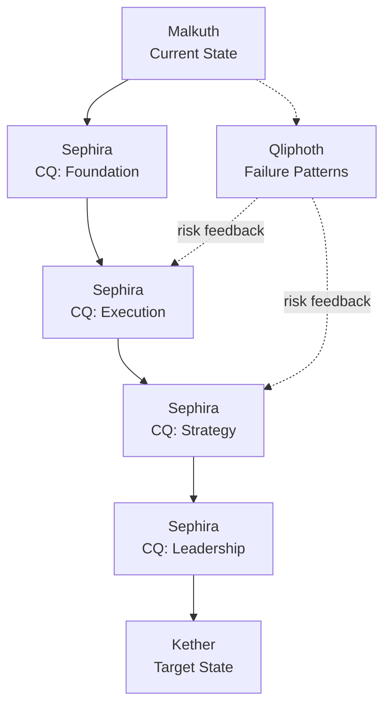

# Sephirot

> From current state to target state, through capability-filled Sephira.

Sephirot is an open-source ontology and knowledge graph framework for modeling transformation.
It represents a journey from **Malkuth** (the current state) to **Kether** (the target state) as a structured graph of intermediate **Sephira**, each filled with measurable **CQ** units.

In practical terms, Sephirot turns a goal like "sales representative -> CEO" or "junior engineer -> principal architect" into:

- a capability graph that explains what must be acquired,
- a transition graph that explains how each step connects,
- a risk graph that explains what can break the path,
- and a reusable ontology that can be shared across people, teams, and domains.

<p align="center">
  
</p>

## What Is Sephirot?

Most knowledge graphs describe relationships between things:

```text
Entity A -> Entity B -> Entity C
```

Sephirot describes transformation between states:

```text
Malkuth
Current State
    |
    |  CQ-filled Sephira
    v
Kether
Target State
```

The central idea is simple:

> To reach Kether from Malkuth, the empty space between them must be filled with Sephira. Each Sephira is not just a mystical label; it is a capability node populated by CQ.

Here, **CQ** means **Capability Quotient**: a structured unit of required ability, evidence, maturity, or readiness.

## Core Model



Sephirot has two complementary graphs:

| Graph | Role |
| --- | --- |
| Sephirot Graph | The positive transformation path from current state to target state |
| CQ Graph | The measurable capability units required to fill each Sephira |
| Qliphoth Graph | The mirrored failure patterns, regressions, and risk states |
| Path Graph | The transition rules between capability nodes |

<p align="center">
  
</p>

## Ontology Vocabulary

| Term | Meaning in Sephirot |
| --- | --- |
| Malkuth | Current state, starting condition, baseline identity |
| Kether | Target state, desired outcome, north-star capability |
| Sephira | Intermediate capability node between Malkuth and Kether |
| CQ | Capability Quotient; measurable capability unit used to fill a Sephira |
| Path | Transformation rule connecting one state or capability to another |
| Qliphoth | Failure pattern, risk mirror, anti-capability, or corrupted transition |
| Knowledge Graph | Domain-specific structure that stores states, CQ, paths, and risks |

The names come from the symbolic structure of the Tree of Life and Tree of Death, but the project itself is a practical ontology and graph framework. The metaphor is used as a compact architectural language: ascent, capability acquisition, integration, and failure mirroring.

## CQ-Filled Sephira

In Sephirot, a Sephira is empty until it is filled by CQ.

```text
Sephira: Leadership

CQ slots:
- Decision CQ
- Communication CQ
- Delegation CQ
- Conflict Resolution CQ
- Organizational Context CQ

Evidence:
- led a project with 5+ contributors
- resolved cross-team dependency
- shipped measurable business outcome
- transferred knowledge to successors
```

A transformation path is therefore not just a chain of labels. It is a progressive capability structure:

```text
Malkuth
Sales Representative
    |
    v
Sephira: Customer Understanding
    CQ: Market CQ, Persona CQ, CRM CQ
    |
    v
Sephira: Revenue Execution
    CQ: Pipeline CQ, Negotiation CQ, Forecasting CQ
    |
    v
Sephira: Strategic Leadership
    CQ: Hiring CQ, Delegation CQ, Budget CQ
    |
    v
Kether
100B KRW Revenue Leader
```

<p align="center">
  
</p>

## Qliphoth: Failure Pattern Graph

Every growth path has a shadow path.

If Sephirot models the capabilities required for ascent, Qliphoth models the anti-patterns that block it.

```text
Target:
Revenue Leader

Positive CQ:
- Strategy CQ
- Customer CQ
- Hiring CQ
- Forecasting CQ

Qliphoth risks:
- overconfidence
- weak CRM discipline
- poor market validation
- micromanagement
- partnership collapse
```

This allows the system to reason about both:

```text
What must be acquired?
What must be avoided?
```

## Example: Succession Agent

Sephirot can be used to build a succession agent for organizations.

```text
Malkuth:
High-performing individual contributor

Kether:
Team lead who can reproduce high performance across others
```

Generated Sephira:

| Sephira | CQ Examples |
| --- | --- |
| Domain Mastery | Product CQ, Customer CQ, Technical CQ |
| Execution System | Prioritization CQ, Delivery CQ, Review CQ |
| Communication | Writing CQ, Meeting CQ, Stakeholder CQ |
| Leadership | Delegation CQ, Feedback CQ, Hiring CQ |
| Knowledge Transfer | Documentation CQ, Mentoring CQ, Succession CQ |

Generated Qliphoth:

| Failure Pattern | Risk |
| --- | --- |
| Hero dependency | The team depends on one exceptional person |
| Tacit knowledge lock-in | Important knowledge remains undocumented |
| Delegation failure | The successor never receives ownership |
| Status distortion | Promotion is based on visibility, not capability |

## Use Cases

- **Career planning**: identify the CQ gap between a current role and a target role.
- **Succession planning**: convert high-performer growth paths into reusable organizational knowledge.
- **Training design**: map curriculum modules to missing CQ slots.
- **Agent planning**: give AI agents a structured model of states, capabilities, and failure patterns.
- **Knowledge transfer**: transform tacit expertise into graph-based institutional memory.
- **Domain ontology generation**: build goal-oriented ontologies for business, healthcare, education, finance, engineering, and research.

## System Components

```text
Input
  Current State + Target State

Ontology Layer
  Malkuth, Kether, Sephira, CQ, Paths, Qliphoth

Graph Builder
  Generates capability paths and failure mirrors

Scoring Engine
  Measures CQ gap, readiness, evidence, and risk

Output
  Transformation graph, learning path, succession map, agent plan
```

## Reference Imagery

The visual assets in `res/` are used as conceptual references for the project's graph language.

| Image | Purpose |
| --- | --- |
| `tree-of-life-death.webp` | Dual graph: success path and failure mirror |
| `sephirot-qliphoth-tree.jpg` | Ascent/descent metaphor for transformation and regression |
| `classic-sephirot.webp` | Staged Sephira structure for capability nodes |
| `serpent-tree.webp` | Continuous path traversal across upper and lower states |

<p align="center">
  
</p>

## Roadmap

- [ ] Core ontology schema
- [ ] CQ schema and scoring model
- [ ] Knowledge graph builder
- [ ] Sephira path generator
- [ ] Qliphoth risk graph generator
- [ ] Evidence and readiness scoring
- [ ] Graph visualization
- [ ] Domain ontology templates
- [ ] Multi-agent planning integration
- [ ] Succession agent prototype

## License

Apache License 2.0
