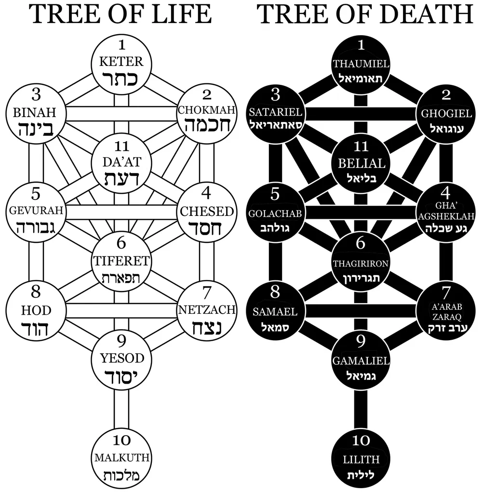
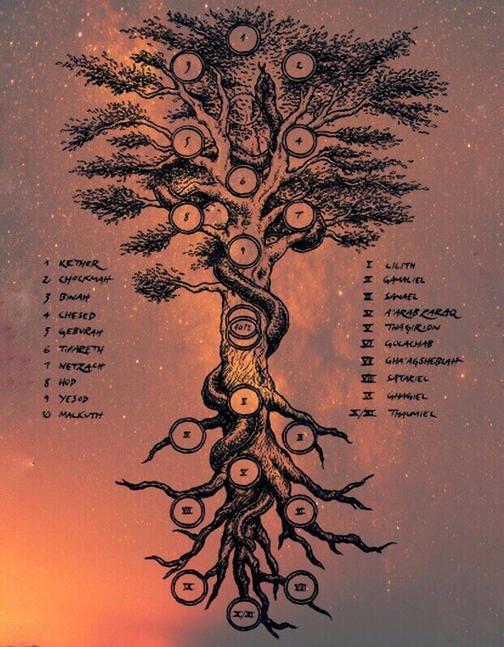
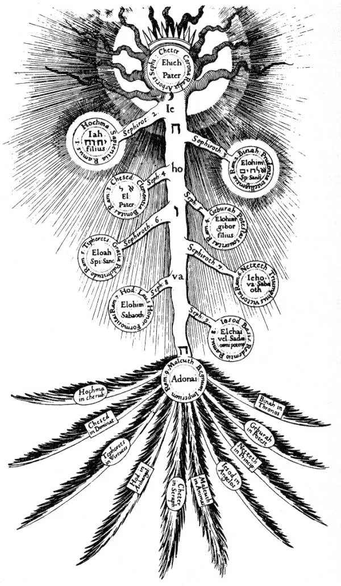
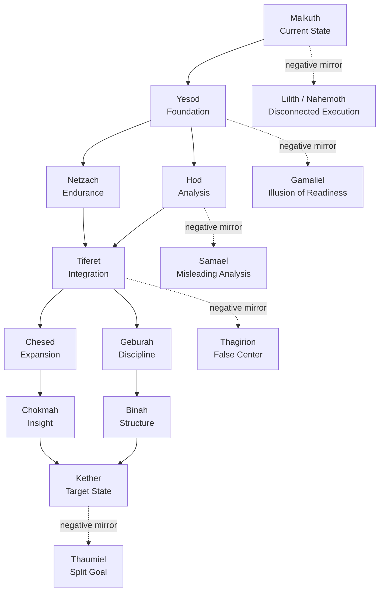
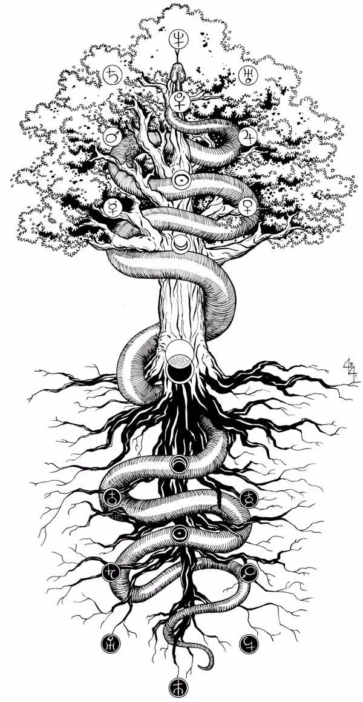

# Sephirot

> A dual-polarity knowledge graph for moving from **Malkuth** to **Kether** through 10 focus values and 22 Competency Question paths.

Sephirot is an open-source ontology and knowledge graph framework for goal attainment.
It models a target journey as two coupled graphs:

- **Sephirot Tree**: the positive knowledge graph of values, capabilities, evidence, and transformation.
- **Qliphoth Tree**: the negative knowledge graph of distortions, failure modes, risks, and regressions.

The project does not hide the occult layer or reduce it to decoration.
The occult structure is the **source schema**: Sephira, Qliphoth, pillars, paths, ascent, descent, and correspondence are preserved as first-class modeling concepts, then compiled into ontology and KG engineering primitives.

Sephirot is therefore a graph language for asking:

```text
Where am I now?
What is the target state?
Which 10 values must I develop?
Which 22 path questions must the knowledge graph answer?
What failure patterns can corrupt the journey?
```

<p align="center">
  
</p>

## Sephirot(medical): Executable Clinical Harness

This fork adds a medical domain adapter for compiling clinical knowledge sources into an executable ontology for MedicalAOS.
The goal is not to turn CEKG or AI Patient KG into a direct label oracle.
Those graphs are source knowledge layers; Sephirot(medical) converts them into runtime judgment criteria, bounded KG activation rules, SCC review contracts, Qliphoth risk mirrors, and patient-level audit artifacts.

In the medical adapter:

- **Malkuth** is the observed patient reality: available EHR, CXR, diagnosis text, KG hits, and runtime trace.
- **Kether** is reviewable diagnostic closure: autonomous finalization, HITL handoff, safety stop, or residual-risk termination with evidence.
- **10 Sephirot nodes** become diagnostic responsibility nodes such as data readiness, explanation consistency, trajectory, cross-modal synthesis, safety judgment, clinical constraint, alternative hypothesis, and final closure.
- **22 paths** become competency questions the harness must answer before a case can be safely closed.
- **Qliphoth mirrors** expose neglected nodes, missing paths, unsupported shortcuts, KG misuse, unsafe finalization, or false certainty.
- **SCC** is the local cyclic repair component opened inside the global diagnostic DAG when cross-role failure cannot be handled by a single pass.

<p align="center">
  
</p>

The MedicalAOS adapter compiles a contract like this:

```bash
sephirot compile-medicalaos \
  --cekg /path/to/cekg/source \
  --aipatient /path/to/ai_patient_kg/source \
  --out /path/to/sephirot_medical_ontology.json
```

The generated ontology is consumed by MedicalAOS as:

- `diagnostic_ascent_contract`: the 10-node / 22-path Malkuth-to-Kether diagnostic ascent.
- `activation_formula`: when KG, SCC, HITL, imaging escalation, or safety stop may open.
- `decision_criteria`: bounded criteria compiled from CEKG, raw diagnosis hints, and AI Patient KG structural priors.
- `scc_cycle_ontology`: local strongly connected components for cyclic repair and condensation back into the global DAG.
- `prompt_cards`: LLM-facing runtime role cards and system prompt fragments.
- `qliphoth_failure_mirrors`: explicit failure mirrors for uncovered evidence, unsafe shortcuts, and corrupted termination.

At runtime, each MedicalAOS case can emit `sephirot_execution_graph.json`.
That graph records the 10 diagnostic nodes, 22 competency paths, observed coverage, matched KG criteria, SCC evidence, and Qliphoth risks for the patient episode.
This is the core Clinical Harness claim: Sephirot(medical) makes the reasoning route auditable before asking whether the prediction score improved.

## Occult x Ontology Engineering

The core stance of this project is:

> Do not erase the occult grammar. Compile it.

Sephirot treats the Tree of Life as a symbolic knowledge architecture and the Tree of Death as its shadow architecture.
The point is not to make a sterile productivity chart with exotic labels.
The point is to keep the vertical ascent, polarity, correspondence, and mirror-risk structure because that is where the graph becomes expressive.

| Occult Structure | KG Engineering Interpretation |
| --- | --- |
| Ain | Unbounded unknown; pre-ontology problem space |
| Ain Soph | Infinite possibility space; unconstrained hypothesis field |
| Ain Soph Aur | First illumination; context prior that makes modeling possible |
| Sephira | Archetypal value node; typed class in the positive graph |
| Qliphoth | Shadow node; anti-pattern or corrupted class in the negative graph |
| Path | Edge between value nodes; transition that must be justified |
| Hebrew-letter path | Stable symbolic edge identifier; default path profile |
| Pillars | Polarity constraints: expansion, restriction, and integration |
| Ascent | Goal-directed transformation from Malkuth to Kether |
| Descent | Manifestation flow from abstract intent to concrete execution |
| Correspondence | Cross-domain mapping between symbols, values, evidence, and actions |

The symbolic layer is part of the API.
It gives the ontology a native language for transformation, not just classification.

## Mystical Qabalah Reference

Sephirot is explicitly in conversation with the **Mystical Qabalah** lineage:
the Tree is treated as a glyph for ascent, correspondence, inner transformation,
and disciplined symbolic reasoning.
That is the bridge this project cares about: occult structure on one side,
ontology/KG engineering on the other.

The image below is used as a visual reference for that lineage, not as decoration.
It anchors Sephirot in the older mystical diagram tradition while the implementation
translates the same structure into value nodes, CQ paths, evidence, and Qliphoth risk mirrors.

<p align="center">
  
</p>

<p align="center">
  <sub>
    Visual reference: Robert Fludd, <em>Tree of Life</em> (1621), public domain via Wikimedia Commons / Deutsche Fotothek.
  </sub>
</p>

## Core Idea

In Sephirot, **Malkuth** is the current state and **Kether** is the target state.
The space between them is not treated as vague ambition.
It is filled with:

- 10 value nodes, represented by the Sephira,
- 22 path-level **Competency Questions**,
- evidence that answers those questions,
- and Qliphoth mirrors that warn where each value or path can fail.

```text
Malkuth
Current State
    |
    |  22 CQ paths
    |  answered with evidence
    v
10 Focus Values
Sephira as ontology nodes
    |
    v
Kether
Target State
```

**CQ** means **Competency Question**.
In ontology engineering, a competency question is a natural-language question that the ontology or knowledge graph must be able to answer.
Sephirot uses CQs as the 22 transformation paths between the 10 focus values.

## Why This Shape?

Traditional Tree of Life diagrams are commonly described as 10 Sephirot connected by 22 paths.
Sephirot turns that symbolic structure into a goal-oriented graph model:

```text
10 Sephira = values to focus on
22 Paths   = competency questions to answer
Qliphoth   = negative mirror of each value and path
```

The positive tree asks:

```text
What must become true for the goal to be reached?
```

The negative tree asks:

```text
What distortion would make the same journey fail?
```

<p align="center">
  
</p>

## Ontology Vocabulary

| Term | Meaning in Sephirot |
| --- | --- |
| Malkuth | Current state, baseline reality, observable starting point |
| Kether | Target state, north-star objective, desired future condition |
| Sephira | One of 10 focus value nodes required for transformation |
| Path | A directed or undirected transition edge between value nodes |
| CQ | Competency Question; a path-level question the graph must answer |
| Evidence | Data, artifact, behavior, metric, or event that supports a CQ answer |
| Qliphoth | Negative mirror graph: failure mode, distortion, anti-value, or corrupted path |
| Da'at | Optional knowledge/integration node; not required in the 10-value MVP |

## The 10 Focus Values

The default graph keeps the traditional top-down numbering, but goal work usually runs as ascent: from **Malkuth** to **Kether**.
Each Sephira becomes a value that must be made explicit, measurable, and answerable.

| # | Sephira | Focus Value | Knowledge Graph Role | Qliphoth Mirror | Failure Mode |
| --- | --- | --- | --- | --- | --- |
| 1 | Kether | Objective Coherence | Target definition and final success condition | Thaumiel | Split goals, contradictory incentives |
| 2 | Chokmah | Generative Insight | Possibility space, intuition, creative alternatives | Ghogiel | Noise, confusion, ungrounded ideation |
| 3 | Binah | Structural Understanding | Constraints, categories, rules, boundaries of meaning | Satariel | Hidden assumptions, opacity, concealed defects |
| 4 | Chesed | Value Expansion | Resources, generosity, leverage, opportunity creation | Gha'agsheblah | Waste, over-expansion, blind resource consumption |
| 5 | Geburah | Discipline and Judgment | Risk gates, prioritization, rejection, enforcement | Golachab | Destructive severity, punitive control, over-pruning |
| 6 | Tiferet | Integration | Central judgment, balance, synthesis, strategy | Thagirion | Ego distortion, false center, performative harmony |
| 7 | Netzach | Endurance | Motivation, persistence, long-horizon momentum | A'arab Zaraq | Scattered desire, obsession, vanity momentum |
| 8 | Hod | Analysis and Communication | Models, language, metrics, documentation, explanation | Samael | Poisoned logic, misleading analysis, rationalization |
| 9 | Yesod | Foundation | Operating substrate, readiness, interfaces, habits | Gamaliel | Illusion of readiness, unstable foundation, fantasy plan |
| 10 | Malkuth | Execution Reality | Current state, material evidence, actual behavior | Lilith / Nahemoth | Disconnected execution, surface-level activity, drift |

The project treats these as **value slots**.
A domain ontology fills them with concrete concepts.

Example:

```text
Goal:
Sales Representative -> Revenue Leader

Malkuth:
Current role, current pipeline, current behavior, current evidence

Kether:
Target revenue leadership capability and measurable outcome

Sephira:
Customer understanding, strategy, negotiation, hiring, operating cadence

Qliphoth:
Poor CRM discipline, overconfidence, false forecasting, hero dependency
```

## The 22 CQ Paths

The 22 paths are modeled as **Competency Questions**.
Each CQ is a question the knowledge graph must answer before the journey can be considered coherent.
This keeps the occult idea of a path as a lived transition, while giving it an engineering form that can be queried, tested, and validated.

This README uses a practical Hermetic-style 22-edge map as the default implementation map.
Different Kabbalistic traditions arrange some paths differently; Sephirot treats the map as a configurable ontology profile.

| Path | Edge | Competency Question |
| --- | --- | --- |
| 11 | Kether -> Chokmah | What possibilities express the target without betraying its core intent? |
| 12 | Kether -> Binah | What constraints make the target concrete, bounded, and verifiable? |
| 13 | Kether -> Tiferet | What central principle keeps decisions aligned with the target state? |
| 14 | Chokmah -> Binah | Which ideas survive structural validation and become usable options? |
| 15 | Chokmah -> Tiferet | Which insight should become the central strategy? |
| 16 | Chokmah -> Chesed | Which opportunities deserve expansion, resources, or sponsorship? |
| 17 | Binah -> Tiferet | Which constraints must be integrated into the main plan? |
| 18 | Binah -> Geburah | Which rules, risks, or boundaries prevent invalid execution? |
| 19 | Chesed -> Geburah | How should expansion be balanced with discipline? |
| 20 | Chesed -> Tiferet | Which value-producing actions serve the integrated strategy? |
| 21 | Chesed -> Netzach | Which growth bets require long-term commitment? |
| 22 | Geburah -> Tiferet | Which risks should reshape the central judgment? |
| 23 | Geburah -> Hod | Which controls must be represented in data, metrics, or process? |
| 24 | Tiferet -> Netzach | What sustained behavior keeps the strategy alive? |
| 25 | Tiferet -> Yesod | What foundation must exist before the plan can manifest? |
| 26 | Tiferet -> Hod | What explanation, model, or metric proves the decision is coherent? |
| 27 | Netzach -> Hod | How do motivation and analysis correct each other? |
| 28 | Netzach -> Yesod | What routines convert persistence into readiness? |
| 29 | Netzach -> Malkuth | Which sustained actions are visible in the real world? |
| 30 | Hod -> Yesod | Which specifications, tools, or protocols make the plan executable? |
| 31 | Hod -> Malkuth | What evidence in the current state confirms or falsifies the analysis? |
| 32 | Yesod -> Malkuth | What minimum viable foundation enables the next concrete step? |

Each CQ path can be stored as a graph edge:

```json
{
  "path": 25,
  "symbolic_profile": {
    "tree": "Sephirot",
    "movement": "ascent",
    "correspondence_layer": ["pathwork", "foundation", "manifestation"]
  },
  "from": "Tiferet",
  "to": "Yesod",
  "cq": "What foundation must exist before the plan can manifest?",
  "positive_graph": ["strategy", "readiness", "operating_model"],
  "negative_graph": ["illusion_of_readiness", "missing_interface", "fragile_process"],
  "evidence": ["runbook", "owner_map", "metric_baseline", "pilot_result"]
}
```

## Positive and Negative Knowledge Graphs

Sephirot does not only ask whether a capability exists.
It asks whether the capability exists without being corrupted by its mirror failure.



The Qliphoth graph is useful because many plans fail not from missing ambition, but from distorted values:

- structure becomes bureaucracy,
- discipline becomes punishment,
- expansion becomes waste,
- analysis becomes rationalization,
- persistence becomes obsession,
- execution becomes motion without transformation.

## Example: Succession Agent

Sephirot can be used to build a succession agent for organizations.
The agent does not only record what a high performer knows.
It models the path by which another person can become capable of reproducing that performance.

```text
Malkuth:
High-performing individual contributor with tacit expertise

Kether:
Team lead who can reproduce performance through people, process, and judgment
```

### 10 Values for the Succession Path

| Sephira | Domain Instantiation |
| --- | --- |
| Malkuth | Current tasks, current outputs, current context |
| Yesod | Repeatable operating habits and baseline process |
| Hod | Documentation, metrics, language, review artifacts |
| Netzach | Motivation, resilience, repeated delivery behavior |
| Tiferet | Balanced judgment across product, people, and execution |
| Geburah | Risk boundaries, prioritization, quality gates |
| Chesed | Mentoring, delegation, resource creation |
| Binah | System structure, role definition, organizational constraints |
| Chokmah | Strategic insight, opportunity sensing, pattern recognition |
| Kether | Succession-ready leadership capability |

### Sample CQ Answers

```text
CQ 31:
What evidence in the current state confirms or falsifies the analysis?

Answer:
The successor has handled three customer escalations, produced weekly written updates,
and maintained delivery quality while the original expert was absent.

Qliphoth check:
If success only occurred under hidden intervention by the original expert,
the path is corrupted by hero dependency.
```

```text
CQ 25:
What foundation must exist before the plan can manifest?

Answer:
A runbook, ownership map, escalation policy, quality baseline, and review cadence
exist before delegation is considered complete.

Qliphoth check:
If the runbook exists but is not used in real incidents,
the path is corrupted by illusion of readiness.
```

## Data Model Sketch

```text
State
  id
  label
  evidence

Sephira
  id
  name
  focus_value
  domain_instantiation
  positive_indicators
  qliphoth_mirror
  failure_indicators

Path
  id
  symbolic_profile
  from_sephira
  to_sephira
  competency_question
  correspondence_layer
  answer_requirements
  evidence_requirements
  risk_checks

TransformationGraph
  malkuth_state
  kether_state
  sephira_nodes
  cq_paths
  qliphoth_nodes
  qliphoth_edges
```

## Use Cases

- **Goal planning**: convert a vague target into 10 focus values and 22 answerable path questions.
- **Career development**: map the gap between current role and target role.
- **Succession planning**: turn tacit high-performer expertise into reusable organizational knowledge.
- **Agent planning**: give AI agents a graph of goals, values, CQs, evidence, and failure modes.
- **Training design**: generate curricula from unanswered CQs.
- **Risk review**: detect whether a plan is being corrupted by Qliphoth-style anti-patterns.
- **Domain ontology generation**: create goal-oriented ontologies for business, healthcare, education, finance, engineering, and research.

## CLI and Agent Skill

Sephirot starts as a CLI-first agent tool.
It follows the same spec-first spirit as Ouroboros: interview first, crystallize a seed spec, block graph construction until ambiguity is low enough, then build/export the artifact.

```bash
python3 -m sephirot.cli profile
python3 -m sephirot.cli templates
python3 -m sephirot.cli template-packs
python3 -m sephirot.cli template-registry
python3 -m sephirot.cli template --name succession-agent --out sephirot.seed.json
python3 -m sephirot.cli new --context "Malkuth human state -> Kether target state" --out sephirot.seed.json
python3 -m sephirot.cli init "Malkuth human state -> Kether target state" --out sephirot.seed.json
python3 -m sephirot.cli validate --input sephirot.seed.json
python3 -m sephirot.cli plan --input sephirot.seed.json
python3 -m sephirot.cli score --input sephirot.seed.json
python3 -m sephirot.cli questions --input sephirot.seed.json --limit 8
python3 -m sephirot.cli build --input sephirot.seed.json --out sephirot.graph.json
python3 -m sephirot.cli visualize --input sephirot.graph.json --format html --out sephirot.graph.html
python3 -m sephirot.cli export-graphml --input sephirot.graph.json --out sephirot.graphml
python3 -m sephirot.cli export-rdf --input sephirot.graph.json --format turtle --out sephirot.ttl
```

The `profile` command is the framework handshake for agent shells and integrations.
It prints the canonical ontology contract: source schema, engineering contract, node labels, relationship labels, 10 Sephirot, Qliphoth mirrors, and 22 CQ paths.

The `validate` and `build` commands are gated by ambiguity:

```text
ambiguity <= 0.2 -> validation passes and build is allowed
ambiguity > 0.2  -> continue the interview
```

The repo also includes a Codex/Claude-style skill at:

```text
skills/sephirot-tree-builder/SKILL.md
```

That skill wraps the CLI as an agent workflow:

```text
Profile -> Template/Interview -> Seed Spec -> Validation Gate -> Agent Plan -> Dual Tree Build -> Visualization -> Graph DB Export
```

Built-in templates currently include:

- `succession-agent`: tacit expertise -> reproducible team capability.
- `agent-runtime`: ad hoc prompts -> Hermes/Ouroboros-style ontology runtime.

Template packs are marketplace-style manifests.
The built-in core pack lives at `template-packs/core.json`, and external packs can be used with:

```bash
python3 -m sephirot.cli template-registry --source path/to/registry.json
python3 -m sephirot.cli templates --pack path/to/pack.json
python3 -m sephirot.cli template --pack path/to/pack.json --name my-template --out sephirot.seed.json
```

The `plan` command turns validation state into agent-role assignments such as Malkuth Witness, Kether Architect, Sephira Mapper, Path Auditor, Qliphoth Red Team, and Graph Scribe.
The `visualize` command renders a seed or graph as HTML, SVG, or Mermaid without external Python dependencies.

## Graph and Ontology Export

Sephirot graph output is designed to be graph-database compatible.
The supported export targets are Neo4j Cypher, GraphML, Turtle, and JSON-LD.

```bash
python3 -m sephirot.cli build \
  --input examples/revenue_leader.seed.json \
  --out sephirot.graph.json

python3 -m sephirot.cli export-neo4j \
  --input sephirot.graph.json \
  --out sephirot.cypher

python3 -m sephirot.cli export-graphml \
  --input sephirot.graph.json \
  --out sephirot.graphml

python3 -m sephirot.cli export-rdf \
  --input sephirot.graph.json \
  --format turtle \
  --out sephirot.ttl

python3 -m sephirot.cli export-rdf \
  --input sephirot.graph.json \
  --format jsonld \
  --out sephirot.jsonld
```

The Cypher export creates:

- `(:Journey)`
- `(:Sephira)`
- `(:Qliphoth)`
- `[:SEPHIROT_PATH]`
- `[:QLIPHOTH_PATH]`
- `[:MIRRORS]`
- `[:STARTS_AT]`
- `[:TARGETS]`

Load into Neo4j with:

```bash
cypher-shell -u neo4j -p "$NEO4J_PASSWORD" -f sephirot.cypher
```

Use Turtle or JSON-LD when the target system expects semantic-web or ontology-exchange artifacts.

## Packaging

Sephirot is installable as a Python package with the `sephirot` console script.

```bash
python3 -m pip wheel . --no-deps --no-build-isolation -w dist
python3 -m pip install dist/sephirot-*.whl
sephirot profile
```

The wheel includes the core template pack and registry manifests under `share/sephirot/template-packs`.

## Reference Imagery

The visual assets in `res/` are used as conceptual references for the graph language.

| Image | Purpose |
| --- | --- |
| `tree-of-life-death.webp` | Dual positive/negative knowledge graph |
| `sephirot-qliphoth-tree.jpg` | Ascent and descent metaphor for transformation and failure |
| `classic-sephirot.webp` | Mystical Qabalah lineage reference; Robert Fludd's public-domain Tree of Life |
| `serpent-tree.webp` | Continuous traversal across the tree |

<p align="center">
  
</p>

## Roadmap

- [x] Core ontology schema
- [x] 10-value Sephira profile
- [x] 22-path CQ profile
- [x] Qliphoth mirror profile
- [x] Evidence fields in seed and graph artifacts
- [x] Ambiguity and structural validation gate
- [x] Knowledge graph builder
- [x] Neo4j Cypher export
- [x] RDF/Turtle and JSON-LD export
- [x] GraphML export
- [x] Codex/Claude-style agent skill
- [x] VS Code extension scaffold
- [x] Graph visualization
- [x] Domain ontology templates
- [x] Succession agent prototype
- [x] Multi-agent planning integration
- [x] Core template pack manifest
- [x] External template pack loading
- [x] Local/remote template registry manifest support
- [x] Packaged Python wheel build
- [ ] Publish Python package
- [ ] Packaged VS Code Marketplace release

## Conceptual References

- Dion Fortune, [*The Mystical Qabalah*](https://search.worldcat.org/title/The-mystical-Qabalah/oclc/1036752840) - Hermetic Qabalah / Western Mystery Tradition reference for treating the Tree as a living glyph of ascent, correspondence, and psychic-spiritual transformation.
- Robert Fludd, [*Tree of Life Fludd.jpg*](https://commons.wikimedia.org/wiki/File:Tree_of_Life_Fludd.jpg) - public-domain 1621 visual reference used for `res/classic-sephirot.webp`.
- Wikimedia Commons, [Kabbalistic Tree of Life with the ten Sephiroth and 22 Hebrew letters](https://commons.wikimedia.org/wiki/File:Kabbalistic_Tree_of_Life_(Sephiroth).svg) - public-domain reference for the 10 Sephiroth / 22-path visual grammar.
- [NamuWiki: 세피로트의 나무](https://namu.wiki/w/%EC%84%B8%ED%94%BC%EB%A1%9C%ED%8A%B8%EC%9D%98%20%EB%82%98%EB%AC%B4)
- [Tree of Life (Kabbalah)](https://en.wikipedia.org/wiki/Tree_of_life_%28Kabbalah%29)
- [Qlippoth](https://en.wikipedia.org/wiki/Qlippoth)
- [32 Paths of Wisdom](https://en.anthro.wiki/32_Paths_of_Wisdom)
- [Use of Competency Questions in Ontology Engineering: A Survey](https://www.researchgate.net/publication/375064996_Use_of_Competency_Questions_in_Ontology_Engineering_A_Survey)
- [A RAG Approach for Generating Competency Questions in Ontology Engineering](https://arxiv.org/abs/2409.08820)

## License

Apache License 2.0
